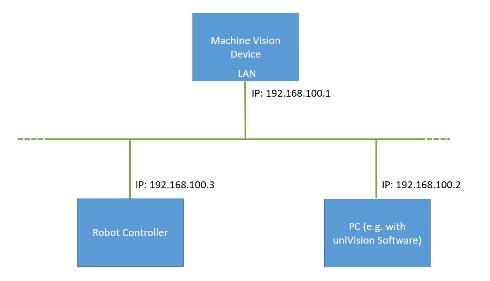

# 2. Network Overview

Connect the network cable from the LAN port of the Machine Vision Device to the robot controller or to a switch in order to work with several devices.

> **NOTE**
>
> - For details about the LAN port of the Machine Vision Device, check the operating instructions of the device.
> - Cabling must support 1 Gbit/s throughout the entire network.  
> - Keep the networks for LAN, RTE, and CAM separated in order to optimize the performance of the Machine Vision Device.
> - Use a unique network configuration for the LAN port of the Machine Vision Device within the LAN network. Furthermore, the network configuration of the LAN port must be different to the network configuration of the RTE and CAM ports of the Machine Vision Device.

