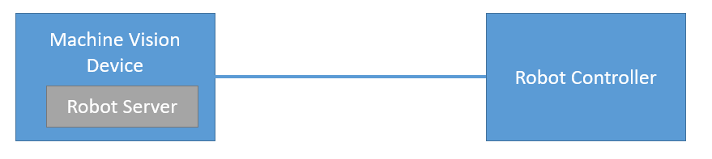

# 3. Robot Vision Basics

Machine Vision Devices connect to robot controllers through the wenglor robot server. The robot server runs directly on each Machine Vision Device, and its settings can be accessed via the device website. For every Processing Instance, you’ll find the robot server available under the “Jobs” tab. For further details, please refer to your Machine Vision Device’s operating instructions.

## Robot Vision Features

- Communication to supported robot manufacturers (listed in dropdown of Robot Manufacturer on the device website of the Machine Vision Device at the tab “Jobs”) . Using `Generic` in the dropdown allows the communication to further robot manufacturers via the generic string based robot vision API (see chapter [4.5 Generic Robots](4_0_robot_vision_server/4_5_0_generic_robots.md)).
- Camera on robot or not on robot.
- If the camera is tilted towards the measuring or picking plane, the calibration compensates for this. Extreme angles should be avoided.
- Hand-eye calibration of robot and camera via several calibration poses where the camera looks from different positions on the calibration plate (buy [calibration plate ZVZJ](https://www.wenglor.com/en/Accessories/Optics-Filters-Deflectors-and-Focusers/Calibration-Plates/c/cxmCID222488) or print corresponding PDF on flat and stiff material by yourself).
- Calibration (including elimination of lens distortion and calculating in mm) is done within the robot server (no separate `Module Image Calibration` within the [uniVision](https://www.wenglor.com/en/Machine-Vision/Machine-Vision-Software/Image-Processing-Software-uniVision-3/c/cxmCID222459) job is required).
- Use `Device Robot Vision` within the [uniVision](https://www.wenglor.com/en/Machine-Vision/Machine-Vision-Software/Image-Processing-Software-uniVision-3/c/cxmCID222459) job for the communication to the robot server

## Robot related hints

- Mount the camera on the robot or not on the robot. For details about mounting options, check the product detail page of the Machine Vision Device on [wenglor.com](https://www.wenglor.com/Machine-Vision/s/Machine+Vision).
- Make sure to use robot-compatible cables. For details, check the product detail page of the Machine Vision Device.
- For safe cable management, use the joint limits in the safety settings of the robot.
- Set the payload on the robot (if necessary).
- Teach the robot TCP (tool center point) in relation to the robot world coordinate system.

> NOTE
>
> Make sure that the mechanical setup of camera, robot and picking plane is unchanged after the calibration. Otherwise, re-calibrating is necessary.
