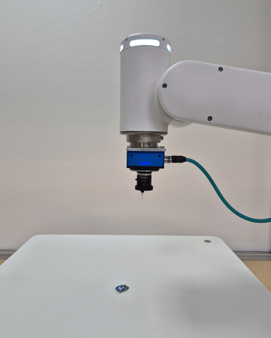
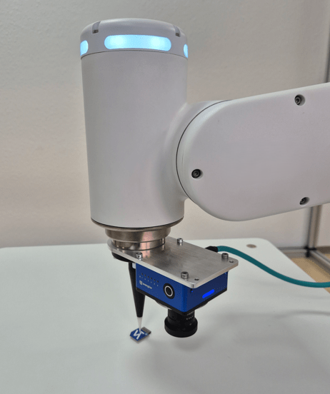

# 4.1.1 Camera on Robot

If the camera is on the robot, teach a minimum of five calibration poses. For more accurate results, teach further calibration poses (e.g., seven to eleven poses).

The first calibration pose is also the detection pose. Make sure to use a suitable pose where the objects are located safely. Make sure to use big variations between the different poses.

<table>
<tr>
<td>
<figure>

<figcaption>Calibration pose 1</figcaption>
</figure>
</td>
<td>
<figure>

<figcaption>Calibration pose 2</figcaption>
</figure>
</td>
<td>
<figure>

<figcaption>Calibration pose 3</figcaption>
</figure>
</td>
</tr>

<tr>
<td>
<figure>

<figcaption>Calibration pose 4</figcaption>
</figure>
</td>
<td>
<figure>

<figcaption>Calibration pose 5</figcaption>
</figure>
</td>
</tr>
</table>

After calibration, an optional verification step can be performed to check its accuracy. Applying it, moves the robot TCP to the bottom left corner of the calibration plate (with an adjustable safety height offset). It is necessary that the calibration plate was not moved between the calibration and the verification step. In case of bad results, check the setup and rerun the calibration.

> **NOTE**
>
> - For the verification step, the Z-axis must point to the object plane.
> - The reprojection error shows how good the calibration was. Typical values are 0.1 for ZVZJ calibration plates and 0.5 for printed calibration plates.

After successful calibration, pick your objects. For the detection pose, it is mandatory to use the position of the first calibration pose.

With the object position sent by the camera, the robot moves to the object pose.

