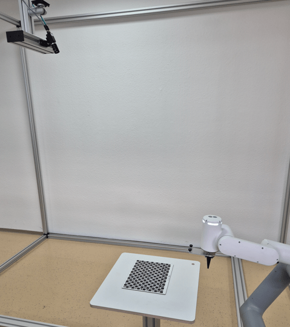

# 4.1.2 Camera not on Robot

If the camera is not on the robot, the calibration process consists of two steps.

For the first step of the calibration process, mount the calibration plate on the robot. Teach a minimum of five calibration poses (e.g., seven to eleven poses). For more accurate results, teach further calibration poses.

<table>
<tr>
<td>
<figure>

<figcaption>Calibration pose 1</figcaption>
</figure>
</td>
<td>
<figure>

<figcaption>Calibration pose 2</figcaption>
</figure>
</td>
<td>
<figure>

<figcaption>Calibration pose 3</figcaption>
</figure>
</td>
</tr>

<tr>
<td>
<figure>

<figcaption>Calibration pose 4</figcaption>
</figure>
</td>
<td>
<figure>

<figcaption>Calibration pose 5</figcaption>
</figure>
</td>
</tr>
</table>

For the second step of the calibration process, put the calibration plate on the measuring or picking plane and capture one single image.

After running the calibration, an optional verification step is possible to check the accuracy of the calibration.
Applying it moves the robot TCP to the bottom left corner of the calibration plate (with an adjustable safety height offset). It is necessary that the calibration plate was not moved between the second calibration step and the verification step. In case of bad results, check the setup and rerun the calibration.

> **NOTE**
>
> - For the verification step, the z axis must point to the object plane. In tilted settings, the Z-axis of the TCP will be perpendicular to the object plane.
> - The reprojection error shows how good the calibration was. Typical values are 0.1 for ZVZJ calibration plates and 0.5 for printed calibration plates.

After successful calibration, pick your objects. Use any detection pose where the camera sees the objects.

With the object position sent by the camera, move the robot to the object.

