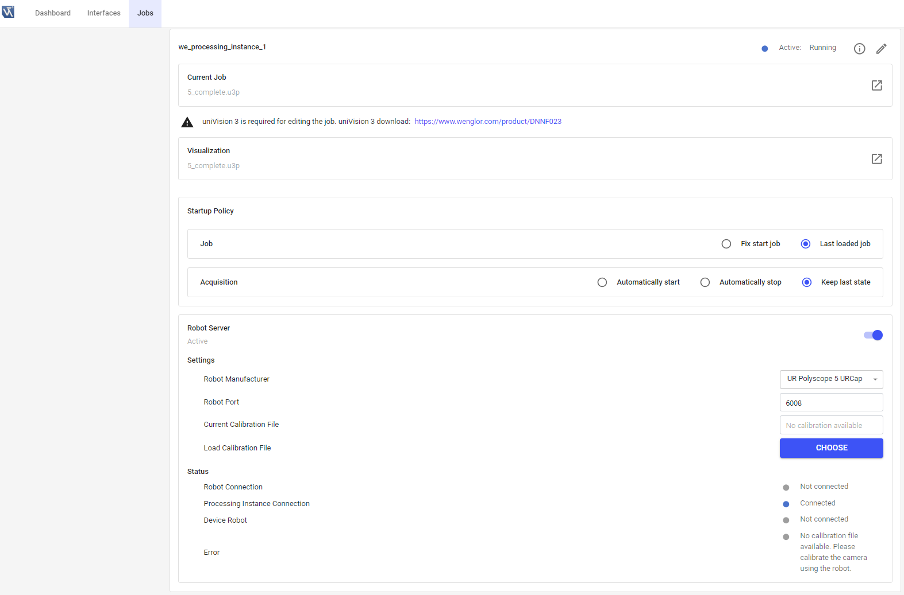

# 4.2 Settings on Device Website

Open the device website of the Machine Vision Device and select the tab `Jobs` to see the robot server settings for each processing instance.

By default, the robot server is active on the [Smart Camera B60](https://www.wenglor.com/en/Machine-Vision/Smart-Cameras-and-Vision-Sensors/Smart-Camera-B60/c/cxmCID221375) and inactive on the [Machine Vision Controller MVC](https://www.wenglor.com/en/Machine-Vision/Machine-Vision-Controllers/c/cxmCID221381). Activate the robot server, if needed. Additional parameters appear if activated:

## Settings

- **Robot Manufacturer**: Select the relevant robot manufacturer (UR Polyscope 5 URCap, UR Polyscope X Script, Kuka, ABB, Kassow or Generic).
- **Robot Port**: Depending on the robot manufacturer, the default port is shown. Edit the port, if needed (e.g., in case of port conflicts at several processing instances on the [Machine Vision Controller MVC](https://www.wenglor.com/en/Machine-Vision/Machine-Vision-Controllers/c/cxmCID221381)). Make sure to use a unique port. In case the port is already in use, change the port and wait approximately one minute for the error to disappear.
- **Current Calibration File**: Shows the name of the currently loaded calibration file.
- **Load Calibration File**: Load another calibration file. The calibration file is only valid for one specific device and valid only if the relation between camera, lens, and robot is unchanged (e.g., it gets invalid if the camera position is changed or if the lens is changed, e.g. via another focus position at [B60](https://www.wenglor.com/en/Machine-Vision/Smart-Cameras-and-Vision-Sensors/Smart-Camera-B60/c/cxmCID221375) autofocus devices).

## Status

- **Robot Connection**: Shows if the robot controller is connected to the robot server or not.
- **Processing Instance Connection**: Shows if the robot server is connected to the processing instance via the LIMA Read Write Limited port or not.
- **Device Robot**: Shows if the robot server is connected to `Device Robot Vision` or not.
- **Error**: Shows if there is any error (e.g., if calibration file does not fit the device).
