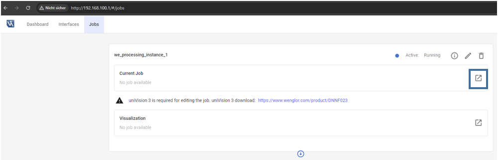
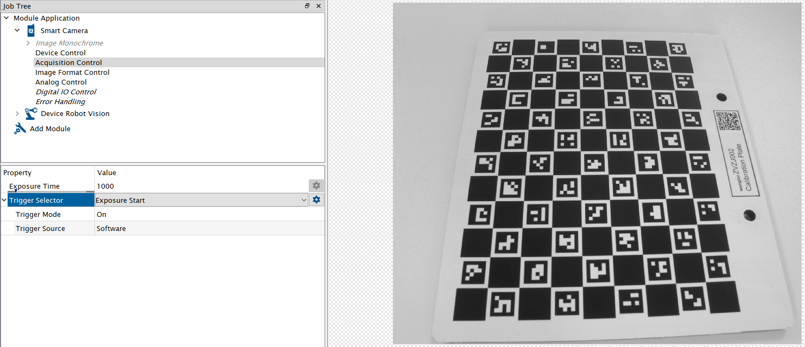

# 4.3 Calibration Job in uniVision

Open the device website of the Machine Vision Device, access the tab Jobs, and open the current job in the [uniVision 3 software](https://www.wenglor.com/en/Machine-Vision/Machine-Vision-Software/Image-Processing-Software-uniVision-3/c/cxmCID222459).

Load the template `Calibrate camera with robot` for easy setup.

Adjust the focus and brightness of the camera to get a sharp and well-illuminated image. By default, Trigger Mode is set to `On` and Trigger Source to `Software` (mandatory for the calibration procedure). Adjust `Trigger Mode` to `Off` and switch to `Run Mode` in order to adjust the camera image. Afterward, change the setting back to Software trigger. If working with color images, make sure that `Create BGRA Image` is active at the input camera (only relevant if working with URCap).

Make sure that `Device Robot Vision` with its default settings is part of the [uniVision](https://www.wenglor.com/en/Machine-Vision/Machine-Vision-Software/Image-Processing-Software-uniVision-3/c/cxmCID222459) job.

Save the calibration job in the device projects folder on the Machine Vision Device. This job will later be used during the calibration procedure to ensure fast and safe image capturing. Therefore, it is important to reuse the job name in the robot program.
