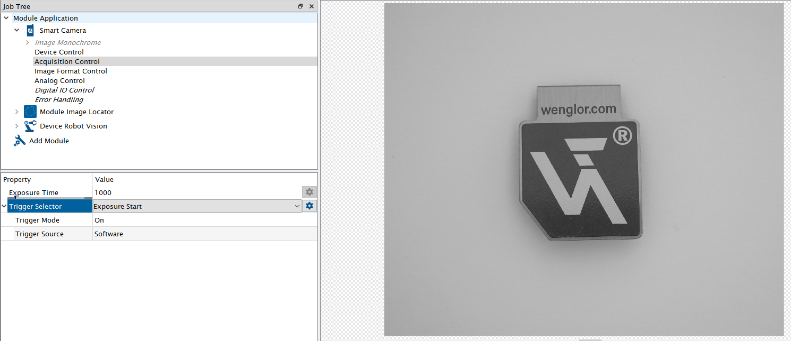
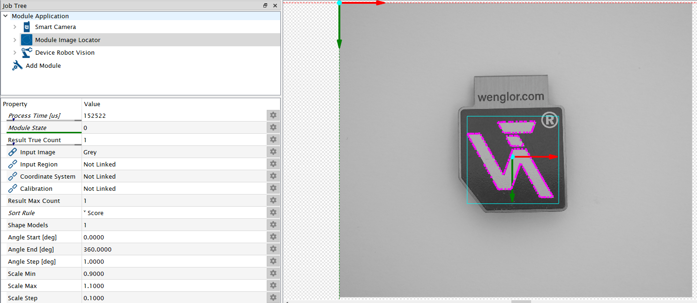

# 4.4 Detection Job in uniVision

Open the device website of the Machine Vision Device, access the tab Jobs and open the current job in the [uniVision 3 software](https://www.wenglor.com/en/Machine-Vision/Machine-Vision-Software/Image-Processing-Software-uniVision-3/c/cxmCID222459).

Load the template `Pick objects with robot` for easy setup.

Adjust focus and brightness of the camera to get a sharp and well illuminated image. By default, Trigger Mode is set to On and Trigger Source to Software (mandatory for the calibration procedure). Adjust `Trigger Mode` to `Off` and switch to `Run Mode` in order to adjust the camera image. Afterwards change the setting back to Software trigger. If working with color images, make sure that `Create BGRA Image` is active at the input camera (only relevant if working with URCap).

Teach your object at `Module Image Locator` (or `Module Image Pattern Match`). For details, check the operating instructions of the [software wenglor uniVision 3 (DNNF023)](https://www.wenglor.com/en/Machine-Vision/Machine-Vision-Software/Image-Processing-Software-uniVision-3/wenglor-uniVision-3-Software/p/DNNF023).

In the template, `Device Robot Vision` is already pre-configured to send the results to the robot server.

| | |
|---|---|
|Process Time $\mu$s | Process time to run the module in $\mu$s|
| Module State | Shows state of module: <ul><li> 0: No error </li><li> Diferent to 0: Error </li></ul>|
| Output | Shows preview of the output sent to the wenglor robot server.|
| Shape Model Count |Defines the number of shape models (object types) used in the submodule `Shape Model Height Difference`|
| Result Max Count | Defines the number of results used in the sub-module `Result List`. |
| Result True Count | Link the value with `Result True Count` of `Module Image Locator` or `Module Image Pattern Match` so that the robot knows how many objects are within the current image. By default, the value is 0. Linking `Result True Count` is mandatory so that the robot server knows how many objects are found in the current image. |

Sub-Module `Shape Model Height Difference` (number of entries depends on parameter `Shape Model Count`):

Height Difference to Calibration [mm] #...x: Defines the height difference of each shape model to the calibration plate. By default, the value is 0.

> NOTE:
>
> - It is possible to pick different object types with different heights.
> - Enter the object height relative to the surface of the calibration plate in mm. If the object is lower than the calibration plate plane, enter a negative number. If the object is higher, enter a positive number. Use the height difference also in case of height variations after the calibration process.

Sub-Module `Result List` (number of entries depend on parameter `Result Max Count`)

Link the result list of `Module Image Locator` or `Module Image Pattern Match` to the Result List of `Device Robot Vision`.

| | |
|-|-|
|Shape Model | Link the `Shape Model` (object type) for each result. By default, the value is 0. |
|X [px] | Link the x position for each result. Linking the x coordinate is madatory. |
|Y [px] | Link the y position for each result. Linking the y coordinate is mandatory. |
|Phi (Z-Rotation)| [deg] Link the Phi value (z rotation) for each result. Linking Phi is mandatory. |
|Additional Value | Optionally link an additional string result (e.g. score value) for each result. |

> NOTE:
>
> - It is possible to detect and pick multiple objects in a single image capture (if setup accordingly in the [uniVision](https://www.wenglor.com/en/Machine-Vision/Machine-Vision-Software/Image-Processing-Software-uniVision-3/wenglor-uniVision-3-Software/p/DNNF023) job).
> - Offsets in x and y can be set directly in `Module Image Locator` or `Module Image Pattern Match`.
> - Pixel results for x and y can only be used by the robot if created by modules that use the  original camera image or any image based on it. No support of x and y coordinates created by modules that use the undistorted or perspective transformed image of `Module Image Calibration` or any image based on it. Exceptionally, it is supported to use the undistorted image in `Module Image Locator` or in `Module Image Pattern Match` with linked input calibration if linking the distorted pixel coordinates at `Device Robot Vision`.

Save the detect objects job in the device projects folder of the Machine Vision Device.
