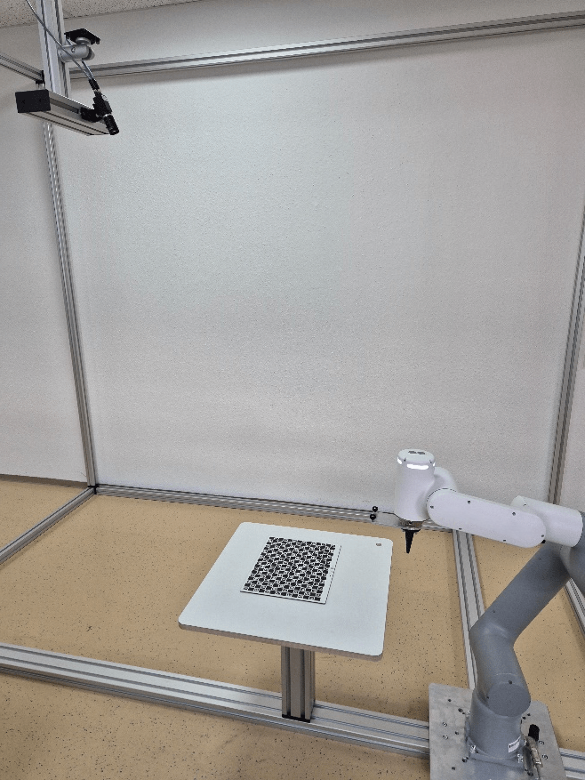

# 4. Wenglor Robot Server

The wenglor robot server supports the communication to specific robot manufacturers. For details, check the dropdown list of robot manufacturers on the device website of the Machine Vision Device and the operating instructions of the device. Using `Generic` in the dropdown allows the communication to further robot manufacturers via the generic string-based robot vision API (see chapter [4.5 Generic Robots](4_5_0_generic_robots.md)).

It is possible to mount the camera on the robot or not on the robot. Even slightly tilting the camera towards the measuring or picking plane is supported.

Calibrate the robot and camera via several calibration poses where the camera looks from different positions on the calibration plate (hand-eye calibration). Use one of the different calibration plates [ZVZJ](https://www.wenglor.com/en/Accessories/Optics-Filters-Deflectors-and-Focusers/Calibration-Plates/c/cxmCID222488) that fit with your use case. The calibration is done inside the wenglor robot server, including the compensation of the lens distortion and the calculations in mm (`Module Image Calibration` is not needed within the uniVision job). Use `Device Robot Vision` within the uniVision job to send results (coordinates of found objects) to the robot server.

